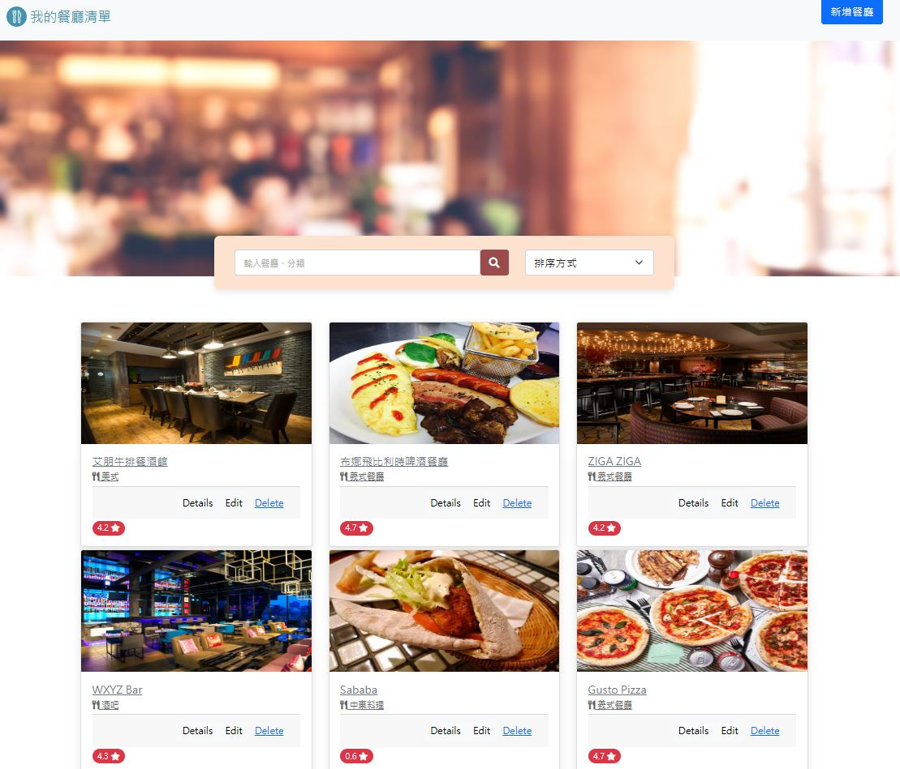

### 功能
- 新增餐廳
- 瀏覽所有餐廳
- 查看餐廳詳細資訊
- 搜尋餐廳
- 排序餐廳
- 修改餐廳資訊
- 刪除餐廳

### 安裝與執行步驟
#### 0. 請先確認已有申請 mongoDB 帳號
#### 1.將專案 clone 至本地端
```
開啟終端機(Terminal)，cd 到存放專案位置後執行：
git clone https://github.com/apolpdga/restaurant-list-v2.0.git
```
#### 2.安裝 npm 套件
```
(1) cd restaurant-list-v2.0    //切至專案資料夾
(2) npm install                //安裝套件 npm 套件
```
#### 3.使用 npm 安裝 express 套件
```
npm i express@4.16.4
```
#### 4.安裝 handlebars
```
npm i express-handlebars@3.0.0
```
#### 5.安裝 mongoose
```
npm i mongoose@5.9.7
```
#### 6.設定環境變數，於專案資料夾下新增.env檔案，並於檔案內MongoDB連線資料，範例如下：
```
MongoDBMONGODB_URI=mongodb+srv://<Your MongoDB Account>:<Your MongoDB Password>@cluster0.xxxx.xxxx.net/<Your MongoDB Table>?retryWrites=true&w=majority
```
#### 7.啟動伺服器
```
npm run dev 
```
#### 8.若看見下列訊息則代表順利運行，代表啟動成功
```
App is running on http://localhost:3000
mongodb connected!
```
#### 9.在瀏覽器輸入 http://localhost:3000 瀏覽內容
```
如果要暫停使用，請在終端機輸入 ctrl + c，再關閉瀏覽器 
如有需要生成種子資料請輸入以下指令: npm run seed
```
### 開發工具
1. Node.js ^14.16.0
2. Nodemon
3. Express ^4.16.4
4. Express-handlebars ^3.0.0
5. MongoDB
6. mongoose ^5.9.7
7. dotenv
8. method-override ^3.0.0
9. Bootstrap v5.13
10. Font-awesome

### 網站畫面

#### 首頁
